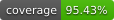

# blog

View at <https://blog.isaacdefrain.com>.

[](https://github.com/Isaac-DeFrain/blog/actions)
[](./scripts/generate-coverage-badge.ts)

Vanilla TypeScript blog with support for GitHub Pages SPA routing, executable code blocks, code highlighting, MathJax equation rendering, GraphViz and Mermaid diagrams, and light/dark themes.

The production build resolves the base path at compile time from the CNAME file (custom domain) or `GITHUB_REPOSITORY` (project Pages), then injects it into HTML. Relative asset URLs keep paths working across deployment shapes.

## Features

- Custom SPA routing for GitHub Pages
- Executable TypeScript code blocks
- Markdown rendering with syntax highlighting
- MathJax support for mathematical equations
- Graphviz diagram support
- Mermaid diagram support
- Dark mode support

## Setup

Install [Nix](https://nixos.org/) and enable [flakes](https://nixos.wiki/wiki/Flakes)

```bash
nix develop
```

Once in the dev shell, install Node.js dependencies

```bash
npm install
```

## Development

Start the dev server

```bash
npm run dev
```

The site will open at `http://localhost:5173` and reload automatically when files change.

## Build

Create a production build

```bash
npm run build
```

Output will be in the `dist/` folder.

## Preview

Preview the production build locally (build first)

```bash
npm run preview
```

The site will open at `http://localhost:4173`.

## Testing

Run all tests

```bash
npm test
```

### Test Coverage

Run test coverage

```bash
npm run coverage
```

Generate coverage badge SVG

```bash
npm run generate-coverage-badge
```

## Home Page

The site root loads `public/home.md` as a standalone page. It uses the same layout as blog posts but has no name, date, or topics metadata. Edit this file to customize the landing page content.

## Adding New Blog Posts

1. Create a new markdown file in `posts/` (e.g. `my-post.md`)
2. Add frontmatter to the markdown file with metadata:

```markdown
---
name: My Awesome Post
date: 2024-01-20
topics:
  - Technology
  - Programming
---

# My Awesome Post

Your content here...
```

The post ID is automatically generated from the filename (e.g. `my-post.md` becomes `my-post`). Posts are automatically sorted by date in reverse chronological order.

## Markdown Features

- **Headers**: `#`, `##`, `###`
- **Code blocks**: Fenced with triple backticks
- **Inline code**: Wrapped in single backticks
- **Links**: `[text](url)` (external/internal)
- **Lists**: Ordered and unordered
- **Blockquotes**: `> text`
- **Inline math**: `$equation$`
- **Display math**: `$$equation$$`
- **Mermaid diagrams**: Fenced code blocks with `mermaid` language identifier
- **Executable TypeScript**: Fenced code blocks with `typescript:run` language identifier

### Executable TypeScript Code Blocks

You can create executable TypeScript code blocks in your blog posts. Executing these blocks do not require any additional compilation/transpilation.

**Usage:**

````plaintext
```typescript:run
const add = (x: number, y: number) => x + y;
const x = 19;
const y = 23;
console.log(`${x} + ${y} = ${add(x, y)}`);
```
````

**Features:**

- Simply removes types from the TypeScript code and executes the resulting JavaScript lazily
- Captures `console.log`, `console.error`, `console.warn`, and `console.info` output
- Provides a `render()` function for HTML output

## Tools

- **Nix flakes**: Reproducible dependencies
- **TypeScript**: Type-safe JavaScript
- **Vite**: Fast build tool and dev server
- **Marked**: Markdown parser
- **marked-highlight**: Syntax highlighting integration for Marked
- **highlight.js**: Syntax highlighting for code blocks
- **MathJax**: Mathematical equation rendering
- **Mermaid**: Diagram and flowchart rendering
- **Graphviz**: Diagram rendering via @viz-js/viz

## License

[MIT LICENSE](./LICENSE)
