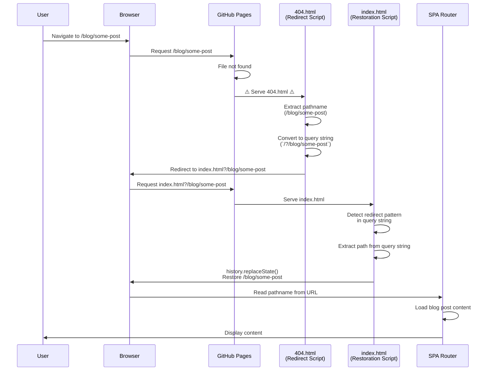
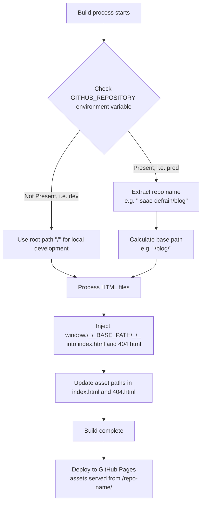
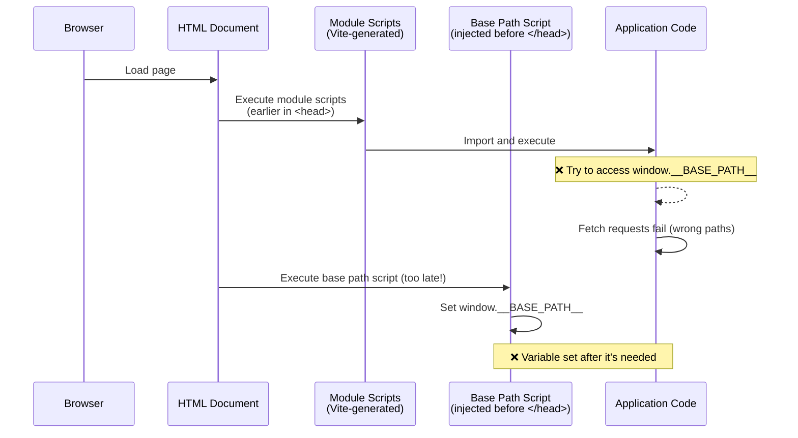
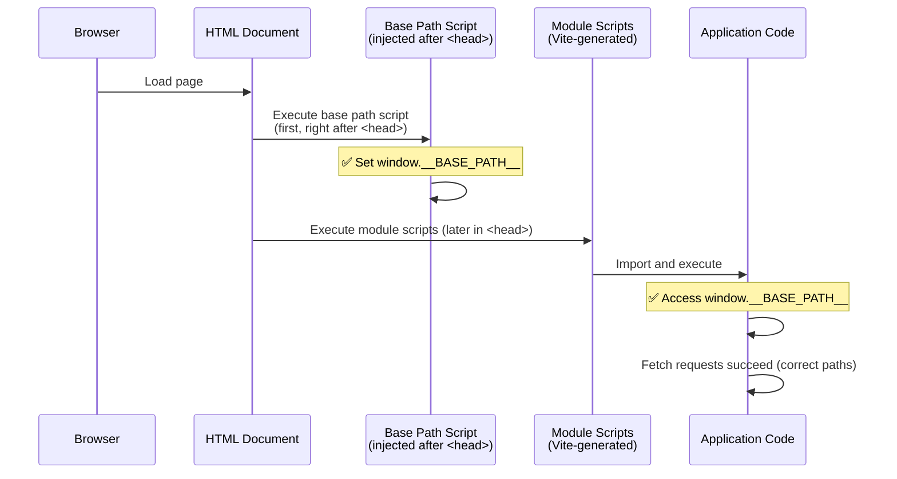

# Building This Blog (part 2) - Routing for GitHub Pages (part 1)

Previous: [Building This Blog (part 1) - Humble Beginnings](./building-this-blog-01-humble-beginnings.md)

## Overview

This blog evolved from a static, multi-page site with no client-side routing into a dynamic single-page application (SPA) with routing support for GitHub Pages. The implementation required solving several challenges:

1. **Development Server Routing**: Making all routes serve `index.html` during development
2. **GitHub Pages Base Path**: Handling the `/repo-name/` base path for project repositories
3. **Script Injection Timing Bug**: Ensuring base path variable is available before module scripts execute
4. **Internal Link Interception**: Converting internal links to SPA navigation
5. **Direct URL Navigation**: Supporting direct navigation to blog post URLs, including section links
6. **Page Refresh Handling**: Ensuring page refreshes work correctly on GitHub Pages

We implement most of these solutions as custom [Vite plugins](https://vite.dev/guide/using-plugins) which do build-time transformations.

We will discuss the first three points in detail in this post. The last three points (internal link interception and direct URL navigation) are discussed in [Building This Blog (part 3) - Routing for GitHub Pages (part 2)](./building-this-blog-03-routing-for-github-pages-02.md)

## Beginnings as a static multi-page app

This blog started with a simple structure:

> each blog post, its own page.

During local development, this meant navigating to different HTML files or markdown files that were rendered separately. The setup was intentionally minimal — just enough to get content displaying in the browser at `localhost:5173/`.

The multi-page architecture worked locally since Vite's dev server can handle individual files. _Ah, these were simpler times. There was no need for complex routing logic back then._

This made the initial implementation simple - but limited, and ultimately did not work on GitHub Pages.

## Consolidating to a SPA with client-side routing

The blog was consolidated from its initial multi-page structure (with separate `blog.html` and `index.html` files) into a single-page application ([`4ddd7c2`](https://github.com/Isaac-DeFrain/blog/commit/4ddd7c2)). This consolidation happened before the GitHub Actions workflow was created, but we quickly discovered that GitHub Pages doesn't support non-hash server-side routing for multi-page applications. The SPA architecture was necessary for deployment.

The consolidation involved:

- **Single entry point**: All blog content would load into a single `index.html` page
- **Dynamic content loading**: Blog posts would be fetched and rendered dynamically using JavaScript
- **State management**: The sidebar, topic filters, and current post selection would persist across navigation
- **Client-side rendering**: Markdown files would be parsed and converted to HTML on the client side using libraries like Marked.js

This architectural change was required for deployment to GitHub Pages.

However, it introduced new challenges.

### Routing for GitHub Pages

When the initial GitHub Actions workflow was created ([`fc25fb6`](https://github.com/Isaac-DeFrain/blog/commit/fc25fb6)), it seemed so straightforward. All we needed to do:

- build the project using Vite's dev server to conduct UA testing
- deploy our build artifacts directly to GitHub Pages

Right? _Right!?_. Unfortunately, I came to find that

> GitHub Pages doesn't natively support SPA routing

When a user navigated directly to a URL, e.g. `https://isaac-defrain.github.io/blog/building-this-blog-01-humble-beginnings`, or even refreshed the page, GitHub Pages would return a 404 error because it was looking for an _actual file at that path_ - but this was actually a _client-side route_.

It turns out:

> When GitHub Pages can't find a file, it serves `404.html`

This is a well-known quirk with a well-known solution, the [`spa-github-pages` pattern](https://github.com/rafgraph/spa-github-pages).

#### `spa-github-pages` Pattern

The `spa-github-pages` pattern is a 404 fallback strategy that works according to this mermaid diagram:



There are two main steps after GitHub Pages serves 404.html:

- **Step 1: Redirect in 404.html**

  The [_redirect script_](404.html#L7-L30) in `404.html`:

  When GitHub Pages serves `404.html` for an unknown route, the `404.html` file contains a _redirect script_ that:
  - Takes the original pathname (e.g. `/blog/some-post`)
  - Converts it to a query string format (e.g. `/?/blog/some-post`)
  - Redirects the browser to `index.html` with the path encoded in the query string

- **Step 2: Restore in index.html**

  When `index.html` loads, the [_restoration script_](index.html#L64-L130) checks for the redirect pattern in the query string:
  - If detected, it extracts the path from the query string
  - Uses `history.replaceState()` to restore the original pathname in the browser's address bar
  - The SPA routing system then reads the restored pathname and loads the appropriate content

  This two-step process ensures that direct URL navigation and page refreshes work correctly on GitHub Pages, even though it doesn't natively support SPA routing.

This almost worked! Just one tiny little problem: assets were not loading properly. The base path was configured incorrectly for GitHub Pages.

### Base Path Injection for GitHub Pages

GitHub Pages stores assets differently than Vite's dev server:

> Project repositories are served from `/repo-name/` rather than the root `/`.

We needed to make this base path available while fetching our blog posts. In order to achieve this, we needed to modify the _build process_ to:

- Detect the repository name from the `GITHUB_REPOSITORY` environment variable available
- Inject a global base path variable into both `index.html` and `404.html`
- Update all asset paths to include the base path when needed

To this end, we created the [`inject-base-path`](../vite.config.ts#218-225) Vite plugin. Here's a flowchart of how it works:



If only that was the end of the story...

### The Script Injection Timing Bug

After implementing our base path injection, we encountered another subtle, yet critical bug: _blog posts failed to load in production_.

The application would start, but no posts would appear. To make matters even worse, all fetch requests would fail silently. No console logs, nothing.

We inserted a few `window.console.log()`s to check what URL we were attempting to fetch the posts from found that _the base path we injected was nowhere to be found_! How could this be?

#### The cause of the script injection timing bug

Our `inject-base-path` Vite plugin was initially inserting the script tag just before the closing `</head>` tag:

```typescript
transformIndexHtml(html) {
  const basePathScript = `<script>window.__BASE_PATH__ = ${JSON.stringify(basePath)};</script>`;
  return html.replace("</head>", `${basePathScript}</head>`);
}
```

However, Vite's build process adds module script tags (`<script type="module" src="...">`) earlier in the HTML. When the browser loads the page, it can execute these module scripts before the base path script runs. This meant that when the blog application code executed, it would try to access `window.__BASE_PATH__` to construct fetch paths, but the variable was still `undefined`, effectively causing the base path to not update.



**The Solution**:

The fix involved moving the script injection point to immediately after the opening `<head>` tag, ensuring the base path variable is defined before any module scripts can execute:



In [code](../vite.config.ts#L218-225):

```typescript
transformIndexHtml: {
  order: "pre",
  handler(html) {
    // Inject base path as a global variable so client code can access it
    // Insert right after the opening <head> tag to ensure it's available before any module scripts
    return html.replace("<head>", `<head>${basePathScript(basePath)}`);
  },
}
```

This fix was applied to both `index.html` and `404.html` processing, ensuring consistent behavior across all entry points. The lesson here is that **script execution order matters**, especially when dealing with build-time code injection and module loading.

### Vite Plugin Architecture

Vite plugins extend Vite's build and development server capabilities by hooking into specific lifecycle events. Each plugin can intercept and transform code at various stages—from initial configuration to final bundle output. Plugins use a hook-based API where you register handlers for events like `buildStart`, `transformIndexHtml`, or `closeBundle`. This allows you to modify HTML files, transform source code, copy assets, or inject runtime variables at precisely the right moment in the build process. The plugin system is what enabled us to customize Vite's behavior for GitHub Pages deployment, injecting base paths and processing files that Vite wouldn't normally handle.

The implementation used several custom plugins working in tandem:

- **`spa-fallback`**: Handles SPA routing in development by serving `index.html` for all routes
- **`inject-base-path`**: Injects `window.__BASE_PATH__` into HTML files at build time (runs during `transformIndexHtml`)
- **`copy-blog-files`**: Ensures blog markdown files are available at runtime by copying them to `dist/posts/` (runs during `closeBundle`)
- **`generate-blog-manifest`**: Generates a manifest file listing all blog posts for both dev and production (runs during `buildStart` and `closeBundle`)
- **`process-404`**: Processes `404.html` with base path injection, `pathSegmentsToKeep` calculation, and asset path rewriting for GitHub Pages (runs during `closeBundle`)

These plugins run at different stages of the build process to ensure proper ordering and availability of files. The `process-404` plugin is particularly important - it:

1. Injects the base path into `404.html` (so the redirect script knows how many path segments to keep)
2. Calculates `pathSegmentsToKeep` based on the base path (e.g. `/blog/` = 1 segment)
3. Updates the redirect script with the correct `pathSegmentsToKeep` value
4. Rewrites asset paths in `404.html` to include the base path prefix

This ensures the spa-github-pages mechanism works correctly for project repositories served from `/repo-name/`.

#### Build Process Flow

The following list illustrates the complete build process, showing when each plugin executes:

**Development Mode:**

1. Development server starts
2. **`configureServer` hook**:
   - **`serve-posts` plugin**: serves `/posts/` files during development
   - **`spa-fallback` plugin**: serves `index.html` for all routes (SPA routing)
3. Dev server ready for requests

**Production Build Mode:**

1. **`buildStart` hook**
   - **`generate-blog-manifest` plugin**: generates `manifest.json` in `posts/` directory for development
2. **`transformIndexHtml` hook**
   - **`inject-base-path` plugin** (`order: "pre"`)
     - injects `window.__BASE_PATH__` into `index.html`
     - runs before Vite's default HTML processing
3. **Vite internal build steps**
   - Resolve dependencies
   - Load modules
   - Transform code
   - Bundle assets
   - Optimize output
4. **`closeBundle` hook**
   - **`copy-blog-files` plugin**: copies `posts/` → `dist/posts/`
   - **`generate-blog-manifest` plugin**: generates `manifest.json` in `dist/posts/` directory
   - **`process-404` plugin**: processes `404.html`:
     - injects base path
     - calculates `pathSegmentsToKeep`
     - rewrites asset paths
5. Build complete - `dist/` ready for deployment

**Key Points:**

- **Development plugins** (`serve-posts`, `spa-fallback`) run during server configuration and handle runtime requests
- **Build plugins** run at specific lifecycle hooks to ensure proper ordering and file availability
- The `inject-base-path` plugin runs with `order: "pre"` to ensure it executes before Vite's default HTML processing
- All `closeBundle` plugins run sequentially after Vite completes its internal build steps, ensuring all assets are available before final processing

## Summary

In this post, we've covered the first three major challenges encountered when deploying a single-page application to GitHub Pages:

1. **SPA Routing**:
   GitHub Pages doesn't natively support SPA routing, so we leveraged the `404.html` fallback mechanism to redirect unknown routes to our SPA. The solution uses a two-step process when GitHub Pages serves `404.html` for an unknown route:
   - a redirect script converts the pathname to a query string format (e.g., `/?/blog/some-post`) and redirects to `index.html`
   - a restoration script in `index.html` detects the redirect pattern, extracts the path from the query string, and uses `history.replaceState()` to restore the original pathname before the SPA router processes it

2. **Base Path Configuration**:
   Project repositories are served from `/repo-name/` rather than root, requiring careful handling of asset paths and routing logic. We implemented a Vite plugin that detects the repository name from the `GITHUB_REPOSITORY` environment variable during build, calculates the base path (e.g. `/blog/`), and injects `window.__BASE_PATH__` into both `index.html` and `404.html`. This global variable is then used by the application code to construct correct asset paths and fetch blog posts from their correct location.

3. **Script Injection Timing**:
   A subtle bug where `window.__BASE_PATH__` wasn't available when module scripts expecting it executed. We fixed this by moving the injection point to immediately after `<head>`, before any module script executes.

The remaining challenges - _internal post/section link interception_ and _direct URL navigation_ - are covered in [Part 3: Routing for GitHub Pages (part 2)](./building-this-blog-03-routing-for-github-pages-02.md), where we'll see how we made both of these work seamlessly with our SPA routing.

---

[Part 3: Routing for GitHub Pages (part 2)](./building-this-blog-03-routing-for-github-pages-02.md)
